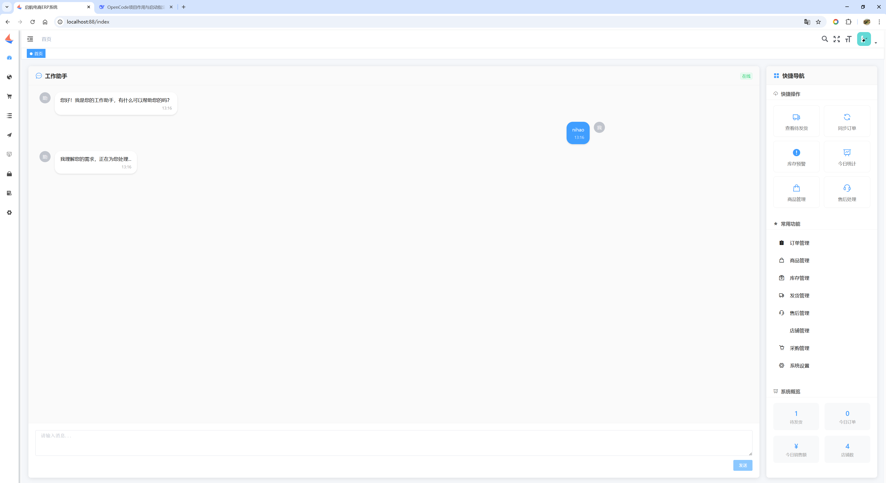
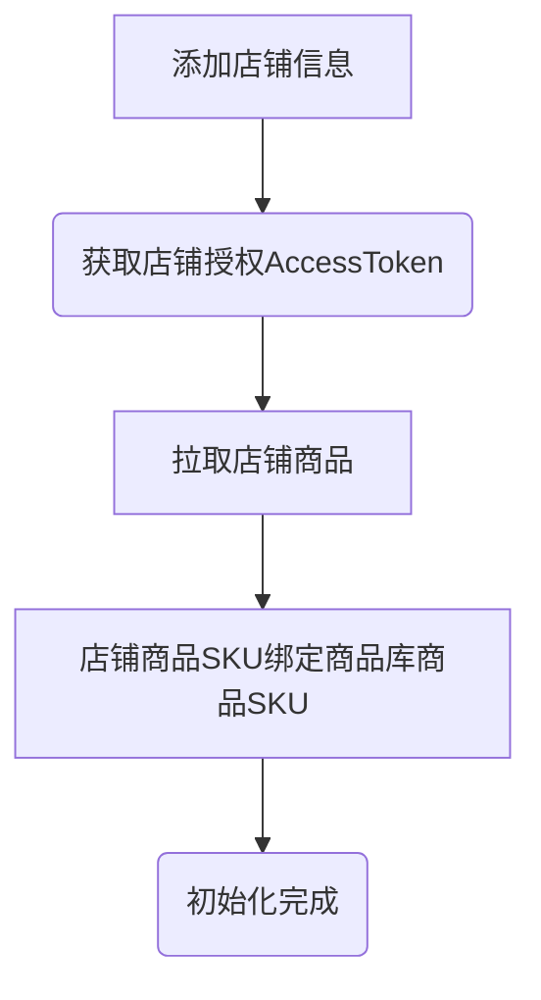
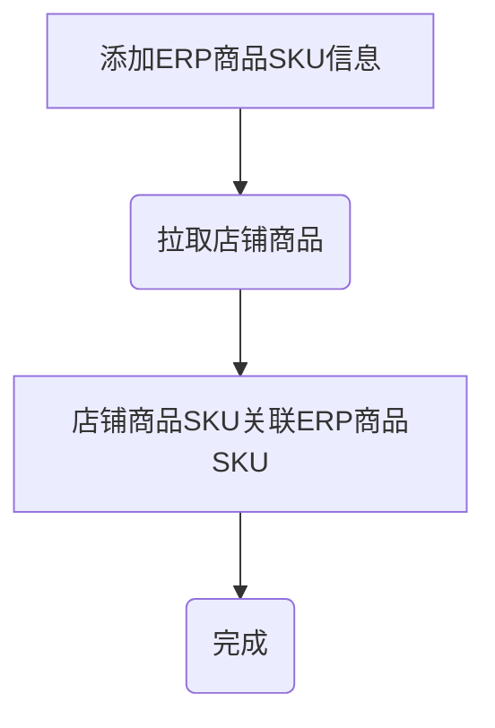
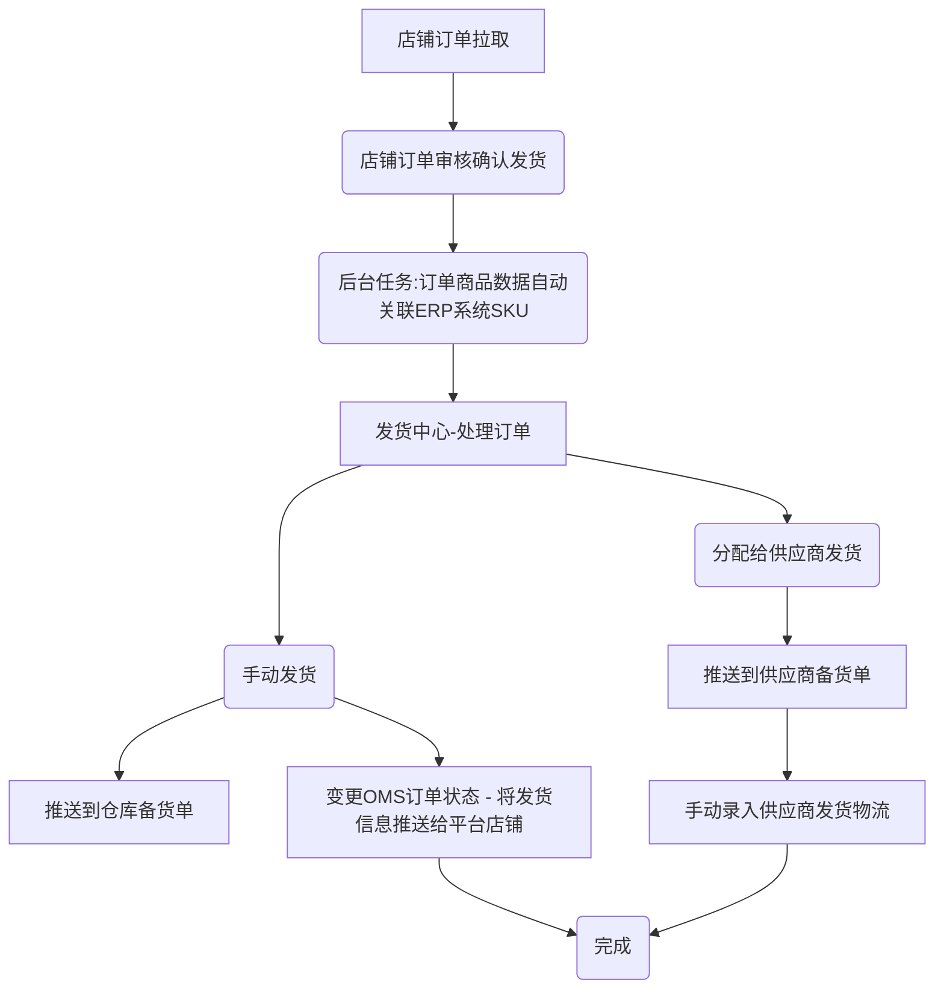
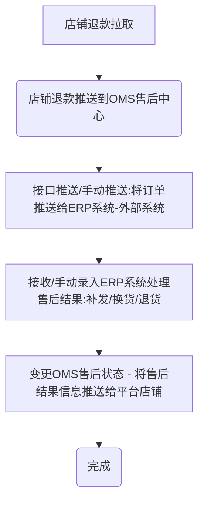

# 启航电商AI ERP系统-原生AI ERP系统

> **欢迎来到我们的开源项目！创新、协作、高质量的代码。您的Star🌟，是我们前进的动力！ 💪✨🏆**

> **项目持续更新中，还有很多不足，请多包含！如有任何疑问请提交issuse！谢谢！ 💪✨🏆**

## 一、系统介绍
启航电商AI ERP系统是基于开源启航电商ERP系统之上全新构建的AI原生ERP系统。

主体功能包括：采购管理、商品管理、店铺商品管理、订单库、店铺订单管理、发货管理（手动发货、电子面单发货、供应商发货）、售后管理、库存管理等。

**全新AI对话式新交互，各种MCP工具开发中。。。请多点包容！多点支持！谢谢！**

#### 系统特点
+ 1、启航电商 AI ERP系统可以帮助企业构建原生AI系统底座。

+ 2、该系统适合想自研电商系统的企业快速构建业务。**系统有一定的门槛，并不适合没有技术团队的企业。**

+ 3、使用启航电商ERP系统的前置条件是：**自行申请各电商开放平台的AppKey** [开放平台申请说明](https://mp.weixin.qq.com/s/KqyNlIVl43dTWicaAeLR1g)

#### 主体功能

启航电商ERP系统支持多平台多店铺订单、售后、商品等管理，目前已接入：淘宝、京东、拼多多、抖店、微信小店，后续会继续接入快手小店、小红书等。

主体功能包括：
+ 商品库管理：商品库管理、分类&分类属性管理、供应商管理等。
+ 订单管理：店铺订单同步、管理。
+ 发货管理：电子面单打印、发货记录、物流跟踪等。
+ 售后管理：店铺售后同步、售后处理（补发、换货、退货处理）等。
+ 店铺&平台参数设置：店铺管理、店铺商品管理（拉取店铺商品、ERP关联）、店铺电子面单账户管理、平台参数设置。

**基本上覆盖了电商订单业务处理全流程，可使用接口对接内部ERP系统。**

**订单打单（电子面单打印）已支持：抖店、微信小店**

## 二、关键流程
### 2.0 平台初始化流程

### 2.1 绑定商品库商品SKU

### 2.2 处理订单（发货）

### 2.3 处理售后

## 三、技术架构

### 3.1 AI大脑
该项目采用**OpenCode**作为AI大脑，既可以使用云端大模型api，也可以使用本地ollama部署大模型。

### 3.2 后端Java
Java后端包含2个部分：
#### 3.2.1 后端常规接口
采用SpringBoot开发后端常规API

#### 3.2.2 MCP
采用**SpringAI** + **Langchain4j** 开发知识库和Tools

## 四、部署说明

#### 0 版本说明
+ Java：17
+ Nodejs：v20.20.0
+ SpringBoot:3
+ MySQL:8
+ Redis:7

#### 1、AI大脑

##### `opencode`部署
+ nodejs版本要求：`v20.x`
+ npm安装方式：`npm install -g opencode-ai`

##### `opencode`启动
打开终端：`opencode serve --port 14967`

#### 2、Java后端
##### 配置MySQL

+ 创建数据库`qihang-erp`
+ 导入数据库结构：sql脚本`docs\qihang-erp.sql`

##### 启动Redis
项目开发采用Redis7

##### 修改项目配置

+ 修改`app`项目中的配置文件`application.yml`配置`Mysql`相关配置。

##### mvn打包部署
+ Java版本：`Java 17`
+ Maven版本：`3.8`
  `mvn clean package`

#### 3、前端 `vue`打包
+ nodejs版本要求：`v20.x`
+ 安装依赖：`npm install --registry=https://registry.npmmirror.com`
+ 打包`npm run build:prod`
+ 访问地址：`http://localhost`
+ 登录名：`admin`
+ 登录密码：`admin123`

## 五、支持一下

**感谢大家的关注与支持！希望利用本人从事电商10余年的经验帮助到大家提升工作效率！**

### 5.1 赠人玫瑰手留余香
💖 如果觉得有用记得点个 Star⭐

### 5.2 一起交流

💖 欢迎加入关注微信公众号和朋友们一起交流！

   

### 6.3 捐助作者
哪怕是堆代码，也是耗费作者不少精力的，如果项目帮到了您可以请作者吃个盒饭！

